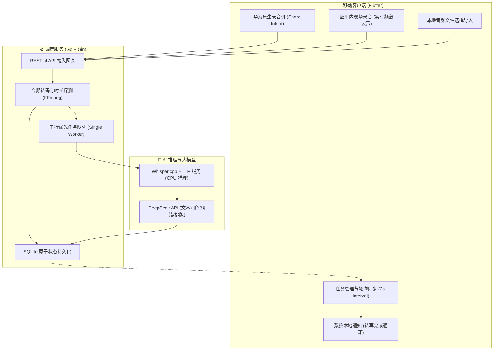

# 智聆转写 (Huawei Whisper AI)

<p align="center">
  
</p>

<p align="center">
  <strong>专为华为/鸿蒙及 Android 生态打造的高可靠离线语音转写与 DeepSeek AI 智能润色系统</strong>
</p>

<p align="center">
  
  
  
  
  
  
</p>

---

## 📖 项目简介

**智聆转写 (Huawei Whisper AI)** 是一套完整的端到端语音转文字与智能润色解决方案。项目由 **Flutter 移动客户端** 与 **Go 高性能异步调度后端** 组成，专为在低成本、轻量级云服务器（如 2核2G Linux）上稳定运行而优化。

系统通过深度整合 **华为原生录音机分享直达 (Share Intent)**、**Whisper.cpp 离线声学推理引擎** 以及 **DeepSeek 大语言模型 (LLM)**，实现了从“录音捕获 -> 格式转换 -> 串行排队 -> 声学转写 -> 标点错字纠正 -> 段落排版 -> 结果推送”的全自动化闭环。

---

## 🌟 核心特性

### 📱 1. 移动客户端 (Flutter App)
- **华为/荣耀系统录音机一键直达**：在手机原生“录音机”中点击录音分享至“智聆转写”，无缝触发后台静默上传转写。
- **高清现场录音**：内置 16,000Hz 采样率单声道 PCM/WAV 现场录制器，支持**动态音频频谱波形可视化 (Waveform Visualizer)** 与暂停/继续控制。
- **本地多格式导入**：全面兼容 `.m4a`、`.wav`、`.mp3`、`.aac`、`.ogg`、`.flac`、`.amr`、`.3gp` 等音频格式。
- **DeepSeek 润色对比**：详情页支持 **「DeepSeek 润色文本」** 与 **「Whisper 原始文本」** 双 Tab 自由切换、一键分段复制与系统级分享。
- **后台通知直达**：当转写任务完成或异常时，通过系统状态栏通知中心发送横幅通知，点击直接跳转至该任务详情。
- **大盘运行监控**：内置服务节点健康监控面板，实时观测队列等待数、成功率、平均耗时与底层组件联通状态。
- **隐私与安全**：客户端通信地址完全通过 `.env` 配置文件加载，UI 界面脱敏展示，敏感信息不入代码库。

### ⚙️ 2. 调度服务端 (Go Backend)
- **单 Worker 串行任务队列**：针对 2核2G 等低算力服务器量身定制，严格串行处理推理任务，彻底杜绝多并发引起的 CPU 打满与 OOM 崩溃。
- **故障崩溃自愈 (Crash Recovery)**：任务状态与元数据原子写入 SQLite 数据库；后端服务重启或崩溃时，**自动恢复未完成的任务（`queued`/`processing`）**，零丢单。
- **客户端幂等性保护**：支持 `client_trace_id` 唯一链路追踪，有效防御网络重试与弱网抖动导致的重复提交。
- **音频时长探测与防护**：集成 `ffprobe` 自动探测音频时长并实施上限截断（默认 30 分钟），保障队列周转效率。
- **DeepSeek 智能重塑**：调用 DeepSeek-V3 接口对转写文本进行智能加标点、同音错别字纠偏与语义段落规整，异常时平滑降级保留原文。
- **标准化 RESTful API**：遵循规范设计，提供任务创建、轮询查询、重试、删除及 `/api/stats`、`/api/health` 监控接口。

---

## 🏗️ 系统架构设计



---

## 📁 目录结构

```text
huaweiWhisper/
├── flutter_app/                # Flutter 移动端跨平台工程
│   ├── assets/                 # 应用图标与静态资源
│   ├── lib/
│   │   ├── config/             # 应用配置与主题规范 (AppConfig, AppTheme)
│   │   ├── models/             # 数据实体定义 (TranscribeTask, ServerStats 等)
│   │   ├── providers/          # 状态管理 (TranscribeProvider, RecordProvider)
│   │   ├── services/           # 核心服务 (ApiService, RecordService, NotificationService 等)
│   │   ├── views/              # 页面视图 (首页, 详情页, 服务大盘, 设置页)
│   │   └── widgets/            # UI 组件 (波形频谱组件, 状态徽标, 任务卡片)
│   ├── .env.example            # 客户端环境变量配置模板
│   └── pubspec.yaml            # Flutter 依赖管理文件
│
├── server/                     # Go 语言后端服务工程
│   ├── cmd/server/             # 服务端入口 main.go
│   ├── internal/
│   │   ├── api/                # HTTP 路由、中间件与控制器
│   │   ├── audio/              # FFmpeg 音频转码与时长探测工具
│   │   ├── config/             # YAML 配置加载与环境映射
│   │   ├── llm/                # DeepSeek 大模型文本润色接口
│   │   ├── model/              # 数据传输对象 (DTO)
│   │   ├── queue/              # 串行任务队列与 Worker 调度
│   │   ├── service/            # 核心业务转写编排逻辑
│   │   ├── store/              # SQLite 数据库持久化存储
│   │   └── whisper/            # Whisper HTTP 服务客户端
│   ├── deploy/                 # 服务器一键部署包与脚本 (Systemd, start.sh, restart.sh)
│   ├── config.example.yaml     # 服务端配置模板 (脱敏)
│   └── go.mod                  # Go 模块管理
│
├── docs/                       # 项目方案设计、架构规范与技术文档
└── .gitignore                  # 全局 Git 忽略规则 (严格脱敏)
```

---

## 🚀 快速上手指南

### 第一步：部署 Go 后端服务

#### 1. 环境准备
- Linux 服务器（推荐 CentOS 7+ 或 Ubuntu 20.04+）
- Go 1.21+
- FFmpeg（用于格式转码）
- 已就绪的 `whisper.cpp` HTTP 服务（可监听在 `127.0.0.1:8081`）

#### 2. 配置与启动
```bash
# 1. 进入 server 目录
cd server

# 2. 复制配置文件模板
cp config.example.yaml config.yaml

# 3. 编辑配置 (填入您的 DeepSeek API Key 及端口等)
vim config.yaml

# 4. 下载依赖并启动服务
go mod tidy
go run ./cmd/server/main.go -config config.yaml
```

> **提示**：生产环境建议使用 `server/deploy/` 中的 `systemd` 服务脚本进行常驻后台管理。

---

### 第二步：配置并运行 Flutter 客户端

#### 1. 环境准备
- 安装 [Flutter SDK](https://flutter.dev) (>= 3.13.0)
- Android Studio / VS Code 及 Android SDK

#### 2. 配置服务端地址
在 `flutter_app/` 目录下复制 `.env.example` 为 `.env`：
```bash
cd flutter_app
cp .env.example .env
```
编辑 `.env` 文件，填入您的 Go 后端服务地址：
```env
SERVER_BASE_URL=http://your-server-ip:8080
```

#### 3. 运行与调试
```bash
# 1. 获取依赖包
flutter pub get

# 2. 运行静态代码检查
flutter analyze

# 3. 连接手机或模拟器调试运行
flutter run
```

#### 4. 打包可发布 APK
```bash
flutter build apk --release
```
生成的安装包路径为：`flutter_app/build/app/outputs/flutter-apk/app-release.apk`，可直接传输至华为/荣耀等 Android 设备进行安装。

---

## 📡 RESTful API 契约一览

| 请求方法 | 路由路径 | 接口描述 | 关键参数 / 特性 |
|---|---|---|---|
| `GET` | `/api/health` | 服务健康与连通性检查 | 检查 Whisper、DeepSeek、FFmpeg 及存储状态 |
| `GET` | `/api/stats` | 服务端运行大盘指标 | 队列长度、吞吐量、平均处理耗时、成功率 |
| `POST` | `/api/transcribe` | 上传音频并创建异步转写任务 | `file` (Multipart), `lang`, `need_polish`, `client_trace_id` |
| `GET` | `/api/transcribe/:task_id` | 轮询/查询单任务状态与结果 | 返回 `status`, `whisper_text`, `polished_text`, `duration_sec` |
| `POST` | `/api/transcribe/:task_id/retry`| 手动重试失败任务 | 自动重新入队执行 |
| `DELETE` | `/api/transcribe/:task_id` | 删除任务及清理音频文件 | 同步删除磁盘源文件及 SQLite 记录 |
| `GET` | `/api/tasks` | 获取历史任务列表 | 支持 `limit`, `offset`, `status` 分页筛选 |

---

## 🔒 隐私与安全性规范

1. **Git 敏感隔离**：`.gitignore` 已全局忽略真实 `.env` 环境变量文件、`config.yaml` 密钥配置文件以及运行时音频数据目录 `server/data/`。
2. **端侧界面脱敏**：客户端设置界面仅提供“测试服务状态”诊断功能，不向用户明文暴露服务器真实 IP 或内部 API 路径。
3. **数据自主可控**：音频数据与 SQLite 转写历史均保存在用户私有服务器本地，不依赖第三方云端存储。

---

## 📄 开源许可证

本项目基于 [MIT License](LICENSE) 协议开源。
